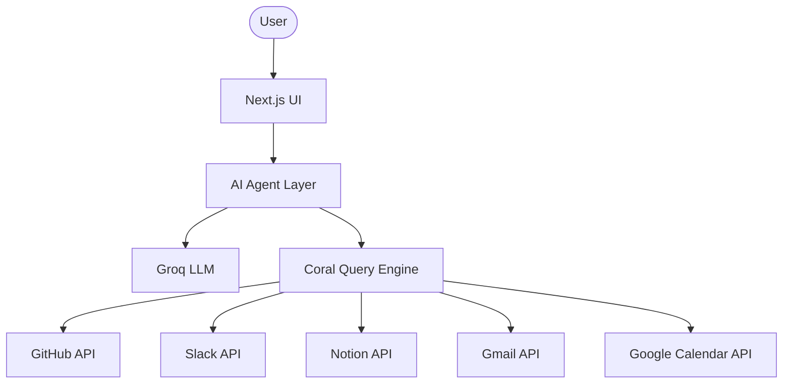

# Nautilus First Mate – AI Personal Command Center

[](https://coral.dev)
[](https://nextjs.org/)
[](https://www.typescriptlang.org/)
[](https://tailwindcss.com/)
[](https://groq.com/)
[](LICENSE)

Nautilus First Mate is an AI-powered personal productivity and operations agent designed to eliminate context switching and information fragmentation. By leveraging Coral as the unified data access layer, the application federates GitHub, Slack, Notion, Gmail, and Google Calendar, presenting them as a single, relational SQL database. 

Rather than relying on fragile API wrappers, custom pagination code, and complex caching strategies, Nautilus First Mate utilizes standard SQL queries to achieve cross-source intelligence, real-time activity analysis, and automated daily standup reports.

---

## Project Overview

In modern engineering and management environments, information is scattered across dozens of tools. An engineer's daily priorities are fragmented between tasks in GitHub, communications in Slack, context in Notion docs, incoming notifications in Gmail, and schedules in Google Calendar. This leads to severe cognitive load, information silos, and constant context switching.

Nautilus First Mate solves this by introducing a centralized operations deck powered by an AI agent that speaks SQL. Instead of building five separate ETL pipelines, Nautilus First Mate queries all systems concurrently using a single query interface. By combining the natural language capability of LLaMA-3.3-70b-versatile with the structured data federation of Coral, the system allows users to ask complex, cross-platform questions and receive precise, source-referenced answers instantly.

---

## Why Coral

Traditional multi-source integrations fail due to three primary limitations:
1. **API Complexity**: Every SaaS provider uses different authentication schemes, pagination strategies, rate limits, and JSON schemas.
2. **Heavy Data Pipelines**: Building warehouse databases or setting up vector databases for RAG is slow, expensive, and runs into real-time synchronization issues.
3. **Lack of Interoperability**: Joining data between GitHub and Slack requires complex in-memory JavaScript mapping algorithms.

Coral was selected because it treats the internet as a local database. It abstracts API boundaries entirely, exposing external services as standard database tables. By handling token authentication, rate limits, pagination, and response mapping behind a standard SQL interface, Coral allows the AI agent to focus entirely on reasoning. 

Furthermore, Coral's capability to execute real-time cross-source SQL joins means the application can cross-reference multiple APIs in a single database execution block, providing instantaneous updates without any server-side database syncing.

---

## How Coral Is Used

Nautilus First Mate is architected with Coral at the absolute center of its data flow.

### Coral SQL
The AI reasoning engine does not fetch raw API data or dump massive JSON payloads into the LLM context. Instead, it generates optimized SQL statements that are run through the Coral database abstraction. This significantly reduces prompt token usage and ensures high-accuracy data retrieval.

### Source Integrations
All target integrations are connected through Coral sources. Once configured, tables such as `github.issues`, `slack.messages`, `notion.pages`, `gmail.messages`, and `google_calendar.events` become immediately accessible.

### Schema Discovery
The application uses dynamic schema catalogs populated by Coral. Before running queries, the agent inspects the available fields and column datatypes to ensure that the generated SQL conforms exactly to the registered schema.

### Local-First Architecture
To maintain maximum data privacy and performance, Nautilus First Mate executes queries through the local Coral CLI (`coral sql`). The Next.js API layer executes shell invocations of the Coral binary on the host machine. If API integrations are unconfigured or offline, the database driver automatically routes queries to a local SQLite-based simulated database, ensuring continuous, zero-configuration operation for evaluation.

### Dynamic Query Generation and Multi-Source Reasoning
When a user inputs a query, the LLaMA-3.3-70b-versatile agent determines which platforms hold the necessary information. It generates a single, multi-table JOIN query, executes it via the Coral query gateway, parses the structured database rows, and synthesizes a concise response with clear source references.

---

## Coral Features Leveraged

* **SQL Interface**: Standardizes all operations using familiar SQL SELECT, JOIN, WHERE, LIMIT, and ORDER BY syntax.
* **Cross-Source Joins**: Joins tables residing in completely different systems (e.g. joining an assignee on GitHub to a username on Slack) in a single statement.
* **Schema Learning**: Automatically discovers and registers API endpoints as relational column mappings.
* **Authentication Handling**: Decouples token management from the application logic. The Coral engine reads variables from the secure environment and injects them into the HTTP headers automatically.
* **Pagination Handling**: Smoothly fetches subsequent pages of API results without requiring application-level cursor logic.
* **Caching**: Avoids redundant, slow network round-trips by caching database indexes and active source schemas.
* **Local-First Security**: Ensures that sensitive tokens and private communications are processed locally on the host machine.
* **CLI Integration**: Spawns clean command executions (`coral sql`) from the Node.js API runtime to maintain a lightweight, serverless-ready architecture.

---

## Architecture

The diagram below outlines the system architecture and explains how Coral acts as the exclusive gateway between the AI agent and the external cloud APIs:



---

## Data Flow

Every request in Nautilus First Mate undergoes a highly structured lifecycle, ensuring that all data processing is driven strictly by Coral's SQL federations:

1. **User Request**: The user enters a natural language prompt (e.g. "What are the latest updates on the compass repairs?") via the Next.js UI.
2. **Intent Analysis**: The AI agent analyzes the prompt alongside the schema catalog retrieved from Coral.
3. **Query Formulation**: The agent generates a compliant SQL statement targeting the federated tables.
4. **Execution Gateway**: The Next.js backend executes the query by calling the host's `coral sql` CLI interface.
5. **API Federation**: The Coral engine maps the SQL statement to the registered REST/GraphQL API endpoints, manages authentication headers, page lists, and rate limiters, and executes HTTP requests to GitHub, Slack, Notion, Gmail, and Google Calendar.
6. **Relational Response**: Coral maps the API payloads back into a flat JSON array of database rows and returns them to the Next.js backend.
7. **Synthesis**: The AI agent reads the structured rows and generates a natural language answer.
8. **UI Presentation**: The Next.js UI displays the assistant's answer, along with the exact compiled Coral SQL query and a copiable code button for full transparent auditing.

---

## Cross-Source Intelligence Examples

By utilizing Coral SQL, the application achieves intelligent correlation that would traditionally require complex data pipeline engineering.

### 1. Pull Request and Slack Discussion Correlation
When resolving outstanding issues, the system joins GitHub issues with Slack discussions to give engineers the immediate historical discussion surrounding a bug:
```sql
SELECT g.title, g.assignee, s.channel, s.message, s.timestamp
FROM github.issues g
JOIN slack.messages s ON g.assignee = s.sender
WHERE s.message LIKE '%bug%' OR s.message LIKE '%repair%'
ORDER BY s.timestamp DESC
LIMIT 5;
```

### 2. Calendar Events and Tasks Analysis
To help the user prepare for upcoming meetings, the agent retrieves the day's schedule and joins it with relevant documentation logs from Notion:
```sql
SELECT c.title, c.start_time, n.title as doc_title, n.last_edited
FROM google_calendar.events c
JOIN notion.pages n ON c.title LIKE '%' || n.title || '%'
WHERE c.start_time >= CURRENT_TIMESTAMP
ORDER BY c.start_time ASC;
```

### 3. Email and GitHub Priority Detection
The agent prioritizes unread emails by cross-referencing incoming message senders with current high-priority assignees on active GitHub tasks:
```sql
SELECT e.subject, e.sender, g.title as issue_title, g.priority
FROM gmail.messages e
JOIN github.issues g ON e.sender LIKE '%' || g.assignee || '%'
WHERE e.is_unread = true AND g.priority = 'high';
```

---

## Example Coral Queries

Below are realistic, production-ready SQL examples that can be run directly inside the Nautilus First Mate SQL Console or via your local terminal:

### Open Pull Requests
```sql
SELECT number, title, state, user__login, created_at 
FROM github.pulls 
WHERE state = 'open' 
LIMIT 5;
```

### Recent Slack Mentions
```sql
SELECT sender, message, channel, timestamp 
FROM slack.messages 
WHERE message LIKE '%urgent%' OR message LIKE '%scurvy%' 
ORDER BY timestamp DESC 
LIMIT 5;
```

### Upcoming Calendar Events
```sql
SELECT title, start_time, end_time, attendees 
FROM google_calendar.events 
WHERE start_time >= CURRENT_TIMESTAMP 
ORDER BY start_time ASC 
LIMIT 5;
```

### Notion Tasks
```sql
SELECT title, status, last_edited 
FROM notion.pages 
WHERE status = 'In Progress' 
LIMIT 5;
```

### Unread Emails
```sql
SELECT id, subject, sender, snippet, date 
FROM gmail.messages 
WHERE is_unread = true 
LIMIT 5;
```

### Cross-Source Join Example
This query joins three separate platforms in one execution, matching team meetings with active development tickets and Slack chat rooms:
```sql
SELECT 
  g.title as ticket_title, 
  g.assignee as officer, 
  s.channel as chat_room, 
  s.message as chat_snippet, 
  c.title as meeting_title, 
  c.start_time as meeting_time
FROM github.issues g
JOIN slack.messages s ON g.assignee = s.sender
LEFT JOIN google_calendar.events c ON c.attendees LIKE '%' || g.assignee || '%'
ORDER BY c.start_time ASC
LIMIT 5;
```

---

## Features

| Feature | Description |
| :--- | :--- |
| **Interactive SQL Console** | A raw database query panel allowing direct execution of SQL strings against the Coral engine with dynamic table views. |
| **Daily Standup Generator** | Aggregates tasks, communications, and meetings into a unified logbook report in a single query pass. |
| **Copiable SQL Previews** | Promotes transparency by showing the compiled SQL query under every chat bubble, featuring a one-click copy button. |
| **Adaptive Schema explorer** | Inspects active database schemas, tables, and columns, adjusting prompt models dynamically based on connected sources. |
| **Direct CSV Exporter** | Converts executed SQL results into clean spreadsheet documents with correct MIME type parameters. |
| **Resilient Mock Sandbox** | Seamlessly diverts to a local SQLite-compatible simulator if API keys are missing, preventing application crashes. |

---

## Tech Stack

| Layer | Technologies |
| :--- | :--- |
| **Frontend** | Next.js 14, React, Tailwind CSS, Framer Motion, Lucide icons |
| **Backend** | Next.js API Routes, TypeScript, Zod validation |
| **AI** | LLaMA-3.3-70b-versatile, Groq SDK |
| **Data Layer** | Coral CLI, Node.js child process execution, local SQLite simulation |
| **Integrations** | GitHub API, Slack Web API, Notion API, Gmail API, Google Calendar API |

---

## Installation

### Clone Repository
```bash
git clone https://github.com/AliRana30/nautilus-first-mate.git
cd nautilus-first-mate
```

### Install Dependencies
```bash
npm install
```

### Configure Environment Variables
Create a `.env` file in the root directory and add your credentials:
```env
GROQ_API_KEY=gsk_your_groq_api_key
GITHUB_TOKEN=ghp_your_github_token
SLACK_TOKEN=xoxp_your_slack_token
NOTION_API_KEY=ntn_your_notion_api_key
GOOGLE_CALENDAR_ACCESS_TOKEN=ya29_your_google_calendar_token
GMAIL_CLIENT_ID=your_gmail_client_id
GMAIL_CLIENT_SECRET=your_gmail_client_secret
```

### Configure Coral Sources
Ensure you have the Coral CLI installed, then link your accounts:
```bash
coral source add github
coral source add slack
coral source add notion
coral source add google_calendar
```

### Run Development Server
```bash
npm run dev
```

---

## Environment Variables

| Variable | Required | Description |
| :--- | :--- | :--- |
| **GROQ_API_KEY** | Yes | Authentication key for the LLaMA-3.3-70b-versatile reasoning model. |
| **GITHUB_TOKEN** | No | Personal access token to read repositories, issues, and pull requests. |
| **SLACK_TOKEN** | No | Web API token to read Slack channels and messages. |
| **NOTION_API_KEY** | No | Integration token to fetch database pages and workspace notes. |
| **GOOGLE_CALENDAR_ACCESS_TOKEN** | No | OAuth2 access token to query schedules and events. |
| **GMAIL_CLIENT_ID** | No | Google Client ID for Gmail API authentication. |
| **GMAIL_CLIENT_SECRET** | No | Google Client Secret for Gmail API authentication. |

---

## Coral Source Setup

To configure and verify your Coral sources, execute the following commands on your host system:

```bash
# Add your platforms
coral source add github
coral source add slack
coral source add notion
coral source add google_calendar

# Test connection integrity
coral source test github
coral source test slack
coral source test notion
coral source test google_calendar
```

### Verification Queries
Confirm everything is connected by running these quick test statements:
```bash
# Check GitHub connection
coral sql "SELECT id, name FROM github.repositories LIMIT 1"

# Check Slack connection
coral sql "SELECT id, channel FROM slack.messages LIMIT 1"
```

---

## Usage

You can query the command center with various operational prompts:

* **Daily Standup**: "What is my standup today?"
  * *Under the hood*: Generates a cross-source join linking issues, Slack messages, and Google Calendar events.
* **Email Prioritization**: "Show my urgent emails."
  * *Under the hood*: Queries unread Gmail messages, sorting them by assignee importance.
* **Pull Request Triage**: "Triage my open pull requests."
  * *Under the hood*: Summarizes open GitHub pull requests that require reviews.
* **Announcements**: "Are there any urgent Slack mentions?"
  * *Under the hood*: Scans Slack messages for keywords like "urgent" or specific assignee names.

---

## Challenges Solved

* **Multi-Source Data Fragmentation**: Consolidates separate, incompatible data architectures into a single relational query layer.
* **Context Switching**: Eliminates the need to open five separate browser tabs to check slack, issues, emails, notion, and calendars.
* **Information Overload**: Uses SQL filters and AI reasoning to extract only the high-value records, leaving out generic API noise.
* **Siloed Context**: Enables direct joins between completely different communication and management platforms, exposing connections that are normally hidden.

---

## Future Enhancements

* **Additional Coral Sources**: Link more platforms such as Jira, Linear, and Salesforce.
* **MCP Integration**: Build out active Model Context Protocol support to let external IDE tools interact directly with the Coral data layer.
* **Advanced Agent Workflows**: Add write-back capabilities allowing the agent to update tickets or send Slack messages directly from SQL query executions.
* **Team Collaboration Insights**: Provide overall team workload analytics by joining issue statuses across multiple user accounts.

---

## Hackathon Alignment

Nautilus First Mate is built from the ground up to showcase the power and architecture of Coral. It does not treat Coral as a minor package dependency, but as the foundational system that makes the entire application possible:

* **SQL Interface**: By converting natural language directly into SQL queries, the system proves that standard relational database operations are the most reliable, token-efficient, and precise way to interface with multi-source cloud data.
* **Cross-Source SQL Joins**: The application serves as an active demonstration of Coral's capability to join data across unrelated APIs (e.g. GitHub and Slack) in real-time, eliminating the need for server-side databases or offline caching pipelines.
* **Schema Learning & Introspection**: By querying Coral's dynamic schema explorer, the application demonstrates how an AI agent can read database metadata to formulate exact SQL queries on the fly.
* **Local-First Security**: By routing CLI queries locally, the application emphasizes the data privacy and control advantages of keeping credentials on the host machine.

---

## License

This project is licensed under the MIT License - see the LICENSE file for details.
